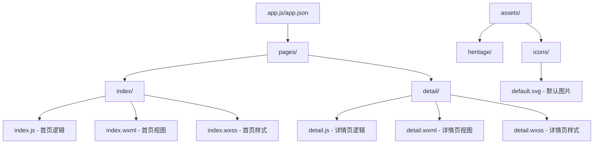
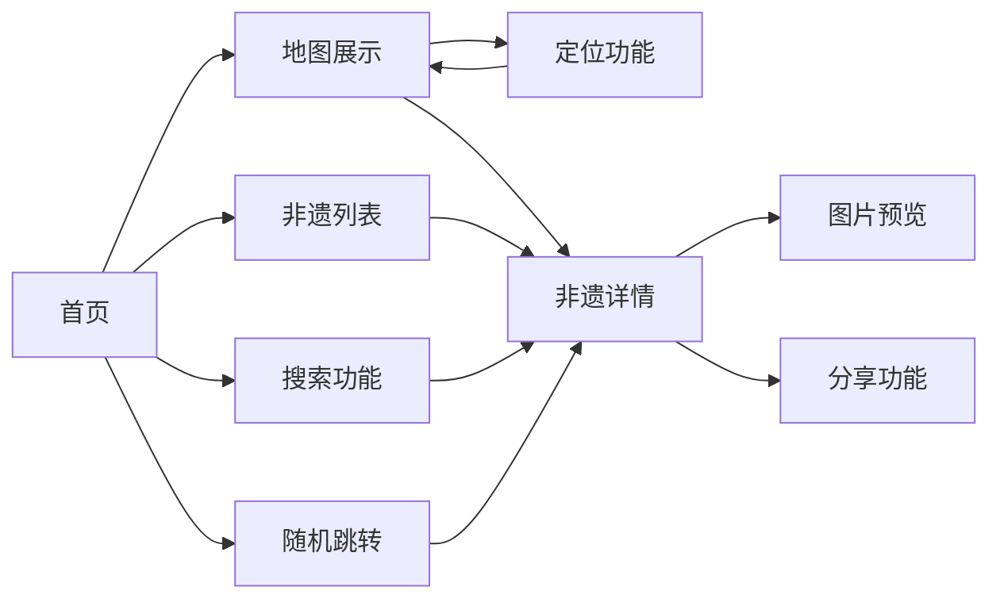

# 潮艺星火小程序

潮艺星火是一个专注于展示和传播潮汕非物质文化遗产的微信小程序。通过地图可视化、详细介绍等方式，让用户了解潮汕地区丰富的非遗文化资源。

## 功能特点

- 🗺️ **地图展示**：以地图形式展示各个非遗点的位置
- 📝 **详细介绍**：提供每个非遗项目的详细信息，包括历史、特点等
- 🎲 **随机发现**：支持随机跳转到非遗点，增加探索趣味性
- 📱 **便捷定位**：支持获取用户位置，方便查找附近的非遗点
- 🔍 **搜索功能**：支持搜索非遗项目，快速找到感兴趣的内容
- 🖼️ **图片预览**：支持查看非遗项目的图片集，并具备图片加载容错处理
- ✨ **过渡动画**：优化的页面切换动画，提供流畅的用户体验
- 📤 **分享功能**：支持将非遗项目分享给其他用户

## 技术架构

- 基于微信小程序原生框架开发
- 使用腾讯地图SDK实现地图功能
- 采用本地数据存储方案，确保快速访问
- 实现了完整的错误处理机制
- 优化的页面动画和转场效果

## 项目结构

## 功能流程

## 主要功能说明

### 首页 (pages/index)
- 地图展示非遗点位置
- 支持列表查看所有非遗项目
- 提供搜索功能
- 随机跳转功能
- 获取用户位置并定位

### 详情页 (pages/detail)
- 展示非遗项目详细信息
- 包含文字介绍、图片等内容
- 支持图片预览和分享
- 具备图片加载错误处理机制
- 页面切换动画效果

### 资源文件 (assets)
- heritage/: 存放非遗相关图标
- icons/: 存放界面通用图标和默认图片

## 开发配置

1. 在app.json中配置了以下权限：
   - 位置信息权限
   - WeUI扩展库

2. 地图相关配置：
   - 使用腾讯地图SDK
   - 配置mapKey用于地图服务

## 使用说明

1. 打开小程序，默认展示地图页面
2. 可以通过底部按钮切换不同功能：
   - 点击定位按钮定位当前位置
   - 点击列表按钮查看所有非遗项目
   - 点击搜索按钮搜索非遗项目
   - 点击骰子按钮随机跳转到非遗点
3. 点击地图标记或列表项目可查看详细信息
4. 在详情页可以：
   - 点击图片进行预览
   - 使用右上角菜单分享给好友
   - 查看完整的项目介绍

## 注意事项

- 首次使用需要授权位置权限
- 建议在网络良好的环境下使用
- 支持横竖屏显示
- 图片加载失败时会显示默认图片

## 实现原理

### 地图组件实现
- 基于腾讯地图SDK封装自定义地图组件
- 使用Marker组件标记非遗点位置
- 实现地图缩放、拖动等交互功能
- 通过wx.getLocation实现定位功能
- 优化地图加载和渲染性能

### 数据管理
- 采用本地JSON存储非遗数据
- 实现数据分类和索引机制
- 使用缓存优化数据加载速度
- 支持数据动态更新和版本管理

### 搜索功能实现
- 使用模糊匹配算法实现搜索
- 支持按名称、类别、地区搜索
- 实现搜索结果权重排序
- 优化搜索响应速度

### 图片加载处理
- 实现图片预加载机制
- 使用占位图优化加载体验
- 图片加载失败自动使用默认图
- 支持图片缓存和清理

### 动画效果
- 使用wx.createAnimation实现过渡动画
- 优化页面切换动画效果
- 实现列表滚动动画
- 添加交互反馈动画

### 性能优化
- 实现分页加载机制
- 优化组件更新逻辑
- 合理使用setData减少性能消耗
- 图片资源压缩和按需加载

### 状态管理
- 使用全局状态管理用户信息
- 实现页面间数据共享
- 管理页面生命周期
- 处理异常状态和恢复

### 权限管理
- 实现位置权限请求和检查
- 处理权限拒绝场景
- 提供权限说明和引导
- 实现权限状态持久化