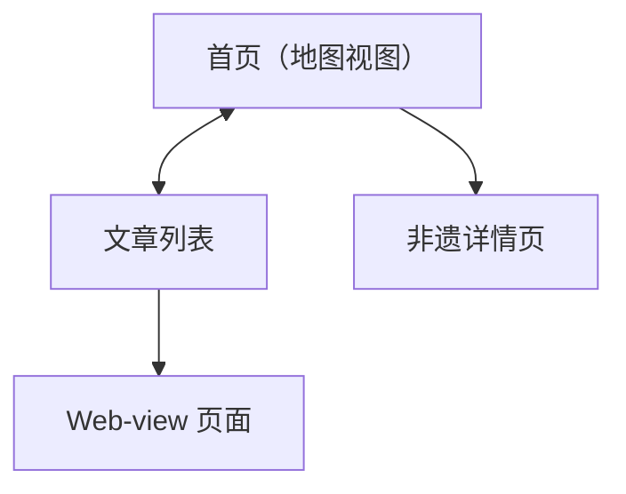

# 潮艺星火小程序

基于微信原生框架的潮汕非物质文化遗产地图展示小程序，以地图可视化为核心交互方式，覆盖潮州、汕头、揭阳三市共 226 个非遗相关地点。

## 一、项目概述与设计背景

潮汕地区现存国家级非物质文化遗产 15 项以上，包括潮州木雕、潮绣、英歌舞、潮剧、潮州工夫茶艺等。然而，这些非遗资源在地理空间上高度分散，分布于三市各区的街巷、祠堂与乡镇之中，缺乏统一的空间化展示手段。

本项目采用**地图可视化**作为核心展示策略，将非遗相关地点标注于交互式地图之上，使用户能够直观感知非遗资源在地理空间中的分布特征，从而实现"以地点带非遗、以空间串文化"的展示效果。

## 二、技术架构

### （一）框架选型

本项目采用**微信小程序原生框架**进行开发，未引入 uni-app、Taro 等跨端框架。该选型的依据在于：原生框架对地图组件（`<map>`）、动画性能、微信原生 API 具有完全的控制能力，且无需额外的编译转换层，有利于调试和性能优化。

### （二）页面结构

应用采用 **TabBar + 子页面**的双层导航架构，共 4 个页面：


```mermaid
graph TD
    A["首页（地图视图）"] <--> B["文章列表"]
    A --> C["非遗详情页"]
    B --> D["Web-view 页面"]
```

| 页面 | 路径 | 功能 |
|------|------|------|
| 首页 | `pages/index` | 全屏地图展示、标记点交互、列表浏览、模糊搜索、随机发现、定位 |
| 详情页 | `pages/detail` | 地点信息展示、图片预览、关联非遗项目列表、分享 |
| 文章列表 | `pages/articles` | 云数据库文章加载、卡片列表展示、下拉刷新 |
| Web-view | `pages/webview` | 加载微信公众号原文（同主体免域名配置） |

### （三）数据层

全部地点数据硬编码于 `app.js` 的 `globalData.heritagePoints` 数组中，共计 **226 条记录，约 118KB**。每条记录包含以下字段：

```
id, name, category, latitude, longitude, address, description, images[], heritageItems[]
```

其中 `heritageItems` 为关联非遗项目数组，每项含 `name`（项目名称）、`type`（非遗类型）、`status`（级别）三个子字段。文章数据则通过微信云数据库（集合 `articles`）存储，与地点数据形成"本地 + 云端"的混合数据架构。

## 三、界面与视觉设计

### （一）色彩规范

应用色彩体系以潮汕传统建筑的赭石棕红色调为基础进行提取与规范化，建立四级色彩层级：

| 角色 | 色值 | 应用场景 |
|------|------|----------|
| 主色调 | `#a85418` | 导航栏背景、功能按钮、标签组件、图标填充 |
| 辅助色 | `#8B4513` | 正文文字、卡片边框、装饰线条 |
| 背景色 | `#F5F5DC` | 列表面板背景、卡片底色（宣纸色） |
| 中性色 | `#999999` | 次要文字、TabBar 未选中状态 |

### （二）纹理设计

详情页内容区域（`location-content`）采用 CSS `repeating-linear-gradient` 实现 45 度交叉斜纹背景纹理。该设计旨在模拟传统宣纸或织物的表面质感，与潮汕非遗的手工属性形成视觉呼应，同时避免对正文阅读造成干扰。

### （三）图标系统

功能图标统一采用 **Material Design 线条风格**，viewBox 固定为 24×24，配色与主色调保持一致：

| 图标 | 文件 | 用途 |
|------|------|------|
| 定位 | `location.svg` | 调用系统定位，回到用户当前位置 |
| 随机 | `dice.svg` | 随机选取一个非遗地点 |
| 列表 | `list.svg` | 打开/关闭非遗地点列表面板 |
| 搜索 | `search.svg` | 展开/折叠搜索输入框 |

TabBar 图标因微信框架限制仅支持 PNG 格式，故同时维护 SVG（设计稿）和 PNG（运行时）两套文件。`assets/heritage/` 目录下另有潮绣、潮州歌册、潮州木雕三幅 800×600 装饰 SVG，作为项目视觉资产储备。

## 四、交互设计与动画

### （一）首页三层交互模型

首页采用**地图—列表—卡片**三层渐进式信息展示模型：

**第一层：地图视图。** 腾讯地图全屏展示，初始缩放级别 14，中心坐标为潮州市中心（23.6618°N, 116.6229°E）。226 个地点以自定义 SVG 标记点标注，点击标记弹出 callout 气泡，显示地点名称与关联非遗数量。

**第二层：侧滑列表面板。** 点击列表按钮后，300px 宽的列表面板从屏幕右侧滑入，地点按 Haversine 球面距离升序排列。面板顶部集成可折叠搜索框，支持对地点名称、非遗项目名称、类型、描述、地址五个字段进行实时模糊匹配。

**第三层：底部信息卡片。** 点击地图标记或列表条目后，信息卡片从屏幕底部滑入，展示地点名称、类别标签、地址、描述及关联非遗项目标签，并提供跳转详情的入口。

此外，首页设有**随机发现功能**：点击骰子按钮后，系统随机选取一个非遗地点，执行地图平移动画后弹出信息卡片，用于提升用户探索意愿。

### （二）详情页动画

详情页采用**时序入场动画**：图片（0.1s）、标题（0.15s）、元信息（0.2s）、内容区域（0.3s）依次从下方淡入。首图应用 Ken Burns 效果（12 秒内从 `scale(1)` 缓放至 `scale(1.05)`），增强视觉沉浸感。

### （三）动画与过渡规范

应用共实现 12 类 CSS 过渡动画，统一遵循短时长（0.4–0.8s）、ease-out 缓动的规范：

| 动画类型 | 触发场景 | 时长 | 缓动函数 |
|----------|----------|------|----------|
| 地图入场 | 首页加载 | 0.8s | ease-in-out |
| 控制按钮滑入 | 地图就绪后 | 0.6s | ease-out |
| 底部卡片弹出 | 选中地点 | 0.4s | ease-out |
| 侧滑面板展开 | 点击列表 | 0.4s | ease-out |
| 搜索框展开 | 点击搜索 | — | translateY |
| 详情页入场 | 页面加载 | 0.6s | ease-out |
| 图片 Ken Burns | 详情页浏览 | 12s | linear |
| 按钮波纹 | 点击按钮 | — | radial-gradient |
| 卡片按压 | :active | — | scale(0.98) |
| 加载指示器 | 数据请求中 | 0.8s/圈 | linear infinite |

## 五、定位与数据处理

### （一）定位与距离计算

#### 1. 坐标系

所有地理坐标采用 **GCJ-02 坐标系**（国测局坐标系），与微信 `getLocation` API 默认坐标系一致。

#### 2. Haversine 公式

列表排序采用 **Haversine 公式**计算用户位置与各地点之间的球面距离。设地球半径 $R = 6371\text{km}$，两点经纬度分别为 $(\varphi_1, \lambda_1)$ 与 $(\varphi_2, \lambda_2)$，则球面距离 $d$ 为：

$$
d = R \cdot 2 \arctan2\!\left(\sqrt{a},\; \sqrt{1-a}\right)
$$

其中：

$$
a = \sin^2\!\left(\frac{\Delta\varphi}{2}\right) + \cos\varphi_1 \cdot \cos\varphi_2 \cdot \sin^2\!\left(\frac{\Delta\lambda}{2}\right)
$$

$\Delta\varphi = \varphi_2 - \varphi_1$，$\Delta\lambda = \lambda_2 - \lambda_1$ 分别为纬度差与经度差。

#### 3. 区域判断

定位功能内含潮汕地区边界检测（纬度 23.0°–24.0°，经度 116.0°–117.2°）。当用户位于该区域外时，系统以 Toast 提示引导，而非强制迁移地图视图，避免产生误导性的地理认知。

### （二）数据采集与处理

#### 1. 地点数据采集

地点数据通过自研 Node.js 脚本（`scripts/fetch-heritage-data.js`）基于腾讯地图 Web Service API 批量采集，处理流程如下：

a. **关键词检索**：定义 30 余个检索关键词，覆盖潮州木雕、潮绣、英歌舞、工夫茶等非遗项目及相关地标。

b. **多区域覆盖**：分别对潮州、汕头、揭阳三市执行检索，确保空间覆盖完整性。

c. **非遗关联匹配**：内置 24 种非遗项目的关键词映射表（`HERITAGE_MAP`），自动将 POI 结果与非遗项目建立关联。

d. **分类标注**：根据 POI 类别和关键词将地点分为博物馆、文化馆、景点、工坊、茶文化、美食六大类别。

e. **去重合并**：基于坐标距离阈值对跨关键词的重复结果进行合并。

原始数据经人工清洗后（`heritage-locations-clean.json`），最终导入 `app.js` 的 `loadDefaultHeritageData()` 方法。

#### 2. 文章数据同步

通过脚本（`scripts/sync-articles-local.js`）对接微信公众号 API，从草稿箱和已发布列表中拉取文章内容，输出为 JSON 格式后导入微信云数据库。当前已同步 8 篇文章，主题涵盖工夫茶、潮剧、牛肉丸、红桃粿、英歌舞、嵌瓷、砂锅粥、潮州木雕。

## 六、后续更新迭代计划

### （一）地图寻宝功能

#### 1. 功能概述

地图寻宝功能旨在将非遗探索游戏化，用户通过实地到访非遗地点、完成互动任务来收集"文化徽章"，提升用户参与感和实地探访意愿。该功能是本项目从"信息展示型"向"互动体验型"升级的核心模块。

#### 2. 技术实现方案

a. **寻宝点位配置**

基于现有 185 个非遗点位数据，选取具有代表性的标志性地点作为"宝藏点"。每个宝藏点定义以下属性：

- `treasureId`：宝藏唯一标识
- `heritagePointId`：关联的非遗地点 ID
- `type`：任务类型（知识问答 / 实景拍照 / 位置打卡）
- `question`：问答型任务的题目内容（知识问答类型专属）
- `badge`：完成后获得的徽章名称与图标
- `latitude/longitude`：触发坐标（可复用关联地点坐标或独立设置）

数据存储于云数据库 `treasures` 集合，通过管理后台维护。

b. **地理围栏检测**

利用微信小程序 `wx.startLocationUpdate` 接口持续监听用户实时位置，当用户进入宝藏点半径 100 米范围内时，前端计算 Haversine 距离并触发寻宝任务弹窗。核心逻辑：

```
onLocationUpdate(userLat, userLng):
  distance = haversine(userLat, userLng, treasure.lat, treasure.lng)
  if distance <= 100:
    triggerTreasureTask(treasure)
```

c. **任务交互流程**

用户到达宝藏点后，根据任务类型进入不同交互：

- **位置打卡**：到达即完成，记录到访时间与位置
- **知识问答**：弹出与该非遗项目相关的选择题，答对即获得徽章
- **实景拍照**：调用 `wx.chooseImage` 拍摄现场照片，上传至云存储

完成后的徽章数据写入 `user_treasures` 集合，包含用户 ID、宝藏 ID、完成时间、任务类型等字段。

d. **进度与成就展示**

在首页新增"寻宝进度"入口，展示用户已收集的徽章数量、总宝藏数量及完成率。徽章页面以九宫格形式陈列所有宝藏点，已解锁的显示彩色徽章图标，未解锁的显示灰色占位。

#### 3. 数据模型设计

| 集合名称 | 主要字段 | 说明 |
|----------|----------|------|
| `treasures` | treasureId, heritagePointId, type, question, badge, lat, lng | 宝藏点定义 |
| `user_treasures` | _openid, treasureId, completedAt, taskType, photoUrl | 用户寻宝记录 |
| `users` | _openid, nickName, avatarUrl, badgeCount, createdAt | 用户基础信息 |

### （二）UGC 互动评论区

#### 1. 功能概述

UGC（User Generated Content）互动评论区允许用户在非遗地点详情页发表评论和图片，分享实地探访体验，形成用户之间的交流氛围。该功能是本项目从"单向信息传播"向"社区化互动"转型的关键模块。

#### 2. 技术实现方案

a. **用户身份体系**

通过 `wx.getUserProfile` 接口获取微信用户的昵称和头像，结合云开发自动注入的 `_openid` 字段建立用户标识。用户信息存入 `users` 集合，首次使用 UGC 功能时自动创建记录。评论列表中展示用户头像和昵称，增强社区归属感。

b. **评论发布与展示**

在详情页（`pages/detail`）底部新增评论区模块，支持以下交互：

- 发布纯文字评论（限 500 字）
- 发布图文评论（文字 + 1-3 张图片）
- 对他人评论进行点赞
- 评论按时间倒序排列，支持分页加载（每页 20 条）

评论数据写入 `comments` 集合，关联 `heritagePointId` 字段实现地点维度的评论聚合。

c. **图片上传与存储**

用户上传的图片通过 `wx.cloud.uploadFile` 接口存储至微信云存储（Cloud Storage），生成云端文件 ID 后作为评论的附件字段保存。展示时使用缩略图模式（`cloud://xxx?imageView2/2/w/200`）降低加载开销。

d. **内容安全审核**

为防止违规内容，评论提交前调用微信云开发内容安全 API 进行审核：

- 文字内容：调用 `cloud.callFunction` 触发云函数，内部调用 `security.msgSecCheck` 接口
- 图片内容：调用 `security.imgSecCheck` 接口检测
- 审核不通过的内容直接拦截并提示用户，不写入数据库

#### 3. 数据模型设计

| 集合名称 | 主要字段 | 说明 |
|----------|----------|------|
| `comments` | _openid, heritagePointId, content, images[], likes, createdAt | 评论内容 |
| `users` | _openid, nickName, avatarUrl, commentCount, createdAt | 用户信息 |

### （三）当前未上线原因说明

上述地图寻宝与 UGC 互动评论区功能虽已完成技术方案设计，但**尚未进入开发阶段**，原因如下：

**核心限制：注册主体资质不足。**

本项目的微信小程序及关联公众号均以**个人主体**注册。根据微信公众平台相关规则：

a. **UGC 评论功能**属于「社区/社交」类目下的服务能力，该类目仅对**企业、政府、媒体及其他组织主体**开放，个人主体无法申请相关类目资质，小程序审核将不予通过。

b. **地图寻宝功能**涉及的积分系统、徽章成就、排行榜等互动机制，属于社交互动类服务的延伸功能，同样受到主体类型的限制，无法通过个人主体小程序提交审核。

c. **内容安全审核接口**（`security.msgSecCheck` / `security.imgSecCheck`）的调用权限及配额也与主体类型相关，个人主体可用的接口能力和调用频率均有限制，无法满足 UGC 内容审核的实际需求。

**后续计划：** 待项目以企业主体重新注册小程序并完成相关类目资质认证后，将优先推进 UGC 互动评论区的开发，随后迭代地图寻宝功能。届时，现有的云开发架构（数据库、云函数、云存储）可无缝支撑上述功能的上线。

## 七、总结

"潮艺星火"小程序以地图可视化为核心手段，实现了潮汕地区 226 个非遗相关地点的空间化展示。技术层面采用微信原生框架与本地数据相结合的轻量架构，设计层面以潮汕传统色彩体系与纹理语言为基础，构建了具有地域文化辨识度的视觉风格。项目整体完成了从数据采集、前端展示到用户交互的完整链路，为非物质文化遗产的数字化传播提供了一种可行的技术方案。

在后续迭代中，项目规划了地图寻宝和 UGC 互动评论区两大功能模块，旨在将应用从"信息展示"升级为"互动体验"平台，进一步增强用户参与感和社区活跃度。目前受限于小程序个人主体的资质要求，上述功能暂未上线，待企业主体注册完成后将优先推进开发。
