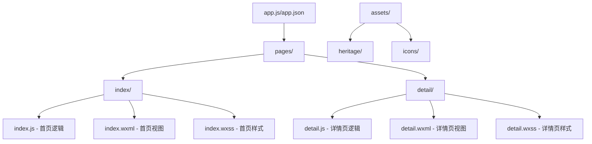
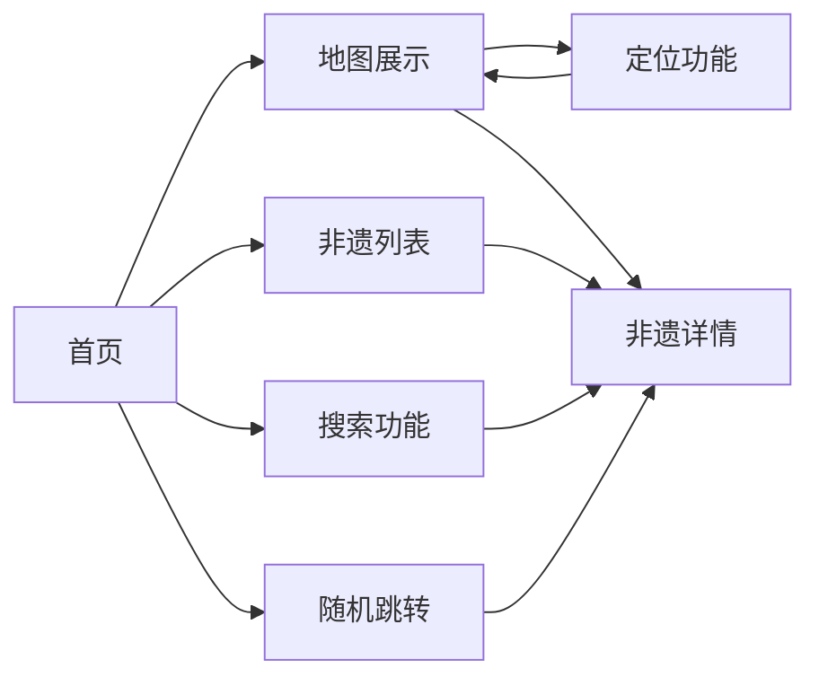

# 潮艺星火小程序

潮艺星火是一个专注于展示和传播潮汕非物质文化遗产的微信小程序。通过地图可视化、详细介绍等方式，让用户了解潮汕地区丰富的非遗文化资源。

## 功能特点

- 🗺️ **地图展示**：以地图形式展示各个非遗点的位置
- 📝 **详细介绍**：提供每个非遗项目的详细信息，包括历史、特点等
- 🎲 **随机发现**：支持随机跳转到非遗点，增加探索趣味性
- 📱 **便捷定位**：支持获取用户位置，方便查找附近的非遗点
- 🔍 **搜索功能**：支持搜索非遗项目，快速找到感兴趣的内容

## 技术架构

- 基于微信小程序原生框架开发
- 使用腾讯地图SDK实现地图功能
- 采用本地数据存储方案，确保快速访问

## 项目结构

## 功能流程

## 主要功能说明

### 首页 (pages/index)
- 地图展示非遗点位置
- 支持列表查看所有非遗项目
- 提供搜索功能
- 随机跳转功能
- 获取用户位置并定位

### 详情页 (pages/detail)
- 展示非遗项目详细信息
- 包含文字介绍、图片等内容

### 资源文件 (assets)
- heritage/: 存放非遗相关图标
- icons/: 存放界面通用图标

## 开发配置

1. 在app.json中配置了以下权限：
   - 位置信息权限
   - WeUI扩展库

2. 地图相关配置：
   - 使用腾讯地图SDK
   - 配置mapKey用于地图服务

## 使用说明

1. 打开小程序，默认展示地图页面
2. 可以通过底部按钮切换不同功能：
   - 点击定位按钮定位当前位置
   - 点击列表按钮查看所有非遗项目
   - 点击搜索按钮搜索非遗项目
   - 点击骰子按钮随机跳转到非遗点
3. 点击地图标记或列表项目可查看详细信息

## 注意事项

- 首次使用需要授权位置权限
- 建议在网络良好的环境下使用
- 支持横竖屏显示